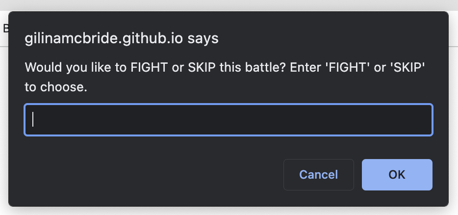

# Robot Gladiators

## Table of Contents

- [Description](#description)
- [Usage](#usage)
- [Application](#application)
- [Questions](#questions)

## Description

Robot Gladiators is a MVP browser game created by following the steps of a course module on Javascript.

## Usage

Open website and follow on screen instructions to play Robot Gladiators.

## Application

Example of Game Alert:

[Link to Deployed Application](https://gilinamcbride.github.io/robot-gladiators/)

## Questions?

For any questions, please email gilinamcbride@gmail.com, or visit any other projects on [Github](github.com/gilinamcbride).
